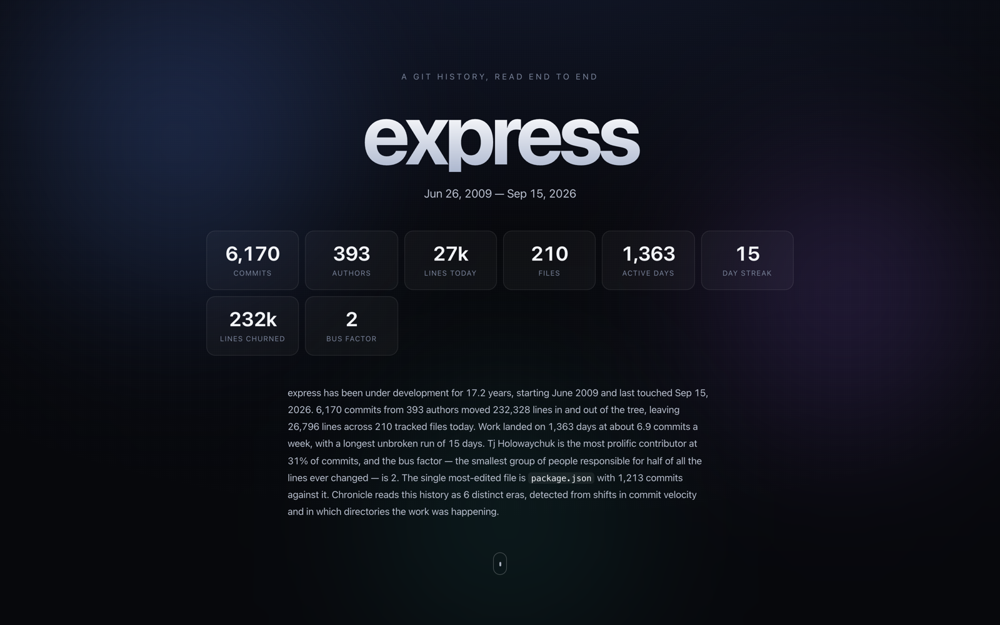
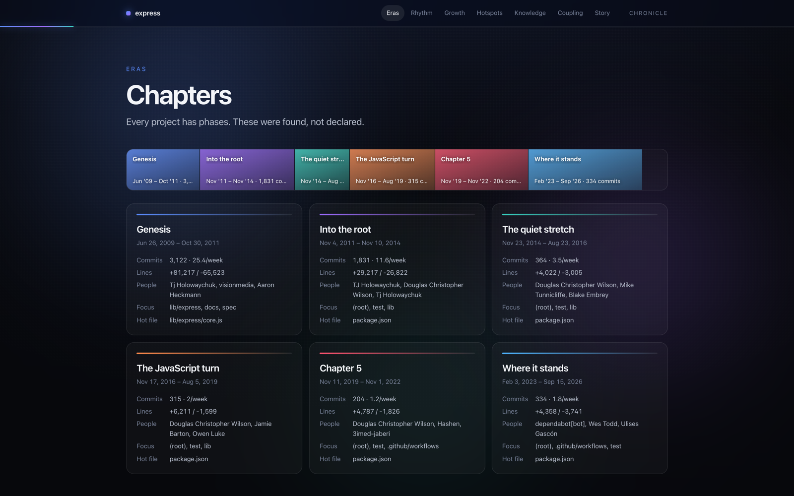
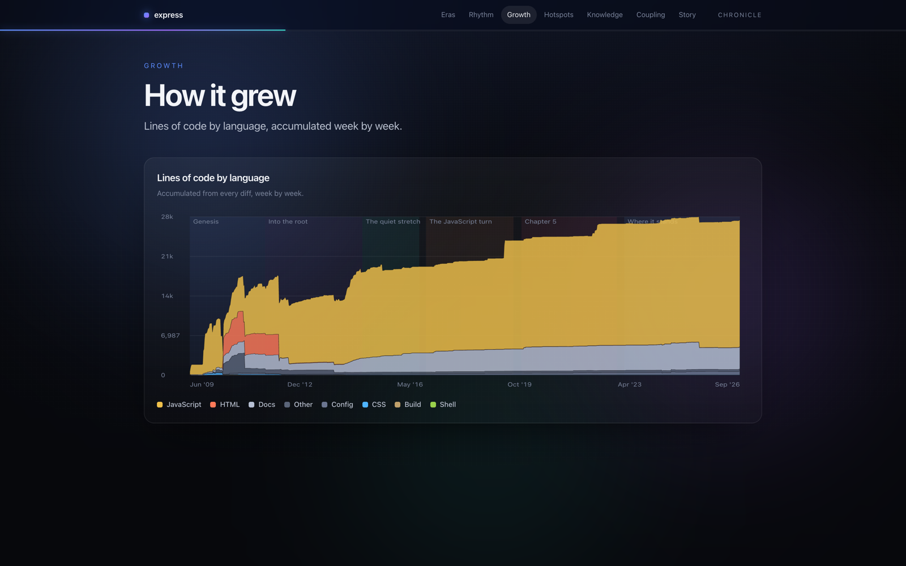

# chronicle

**Point it at a git repository, get back a single HTML file that tells the story of how that codebase evolved.**



<p align="center"> </p>

> Real report on [expressjs/express](examples/express.html): 6,170 commits, 393 authors, 17 years, parsed in under two seconds. Download the file and open it; it is fully self-contained.

## Why

A repository's history is the most detailed document a team owns and the one nobody reads. `git log` answers
"what changed"; it never answers *when did this project change direction*, *which files are load-bearing*,
*who is the only person who understands `billing/`*, or *what always breaks together*. chronicle reads the whole
history in one streaming pass and lays those answers out as a report you can send to someone.

One command, one file, no server, no dependencies, works offline.

## 60-second quickstart

```bash
git clone https://github.com/neelbarm/chronicle && cd chronicle
npm install
npm run build
node dist/cli.js ~/some/repo -o report.html --open
```

Or, once published:

```bash
npx chronicle ~/some/repo -o report.html
```

The report is a single self-contained HTML file — no CDN, no fonts to fetch, no network at runtime. Open it from
disk, email it, drop it in a PR.

## Demo

```bash
npm run demo
```

Writes `examples/mixpilot.html` and `examples/chronicle.html`, running read-only against the repos on this machine.

## What is in the report

| Section | What it shows |
| --- | --- |
| **Hero** | Commits, authors, current LOC, active days, longest streak, bus factor — counted up on scroll |
| **Chapters** | 3–8 automatically detected eras, as a timeline band and per-era cards |
| **Rhythm** | Weekday × hour commit heatmap and a commits-per-week area chart |
| **Growth** | Stacked area of lines of code by language, accumulated week by week, with era bands behind it |
| **Hotspots** | Squarified treemap of the tree as it stands: area is current LOC, colour is churn per file, click a directory to zoom in |
| **Knowledge** | Ownership by top-level directory, bus factor per directory, consistent author colours |
| **Coupling** | The 30 strongest co-change pairs as a force-directed graph and a table |
| **Story** | A readable paragraph per era |

## How it works

**Streaming git log parse.** One `git log --numstat` process, stdout consumed as it arrives with back pressure,
parsed by a chunk-safe incremental parser. Records are separated by `\x1e` and fields by `\x1f` so subjects
containing anything at all stay parseable. Renames (`src/{a => b}.ts` and `a.txt => b.txt`), C-quoted paths with
octal escapes, binary files (`-`/`-`), empty commits and merge commits are all handled. Because git emits
newest-first, renames resolve *forward*: when the parser meets `a.ts => b.ts` it knows every earlier mention of
`a.ts` is the file called `b.ts` today, so a file's churn stays on one identity across its whole life. Nothing but
counters is retained — 6,000 commits of express parse in under a second in ~100 MB.

**Current LOC.** `git ls-files` plus a single `git grep -I -c ''` — one process that reports line counts for every
tracked text file and already knows which blobs are binary, instead of tens of thousands of file reads.

**Churn and hotspots.** Per-file commit counts and +/- lines are folded into a directory tree, then laid out with a
squarified treemap (Bruls/Huizing/van Wijk). The layout for *every* directory level is precomputed server-side in
the unit square, so zooming is instant in the browser and the algorithm is covered by Node tests (areas sum to the
parent, no overlaps, area proportional to value). Directories are coloured by churn *per file* so a big quiet
directory doesn't look hotter than the one file everybody keeps editing.

**Co-change coupling.** For every commit, each unordered pair of files it touched gets a tally. Commits touching
more than `--coupling-cap` files (default 40) are skipped entirely — a 400-file reformat contributes ~80,000 pairs
and zero signal — and the table self-prunes singletons if it ever grows past ~1.2M entries. Pairs are ranked by
`co-changes / commits(rarer file)`, so "when this changes, that follows" rather than "both of these change a lot".
The graph is laid out by a ~40-line force simulation (Coulomb repulsion, Hooke springs, weak centring) written for
this project; nodes are draggable.

**Era detection.** Two things mark a new chapter in a codebase: the pace changes, and the *place* changes. Every
week boundary is scored on a combination of normalised commit-velocity delta and the Jaccard distance between the
sets of directories touched on either side, with a bonus for restarting after a long silence. The strongest
boundaries are accepted greedily subject to a minimum era width, yielding 3–8 eras. Histories shorter than six
weeks are segmented at commit granularity instead, so a weekend project still reads as a beginning, middle and end.

**Narrative.** Each era's paragraph is generated from its own statistics by a template engine with rotating sentence
forms — no model required, and it reads like prose rather than a stat dump.

## CLI reference

```
chronicle [repo-path] [options]

  -o, --out <file>        Output HTML file (default: chronicle.html)
      --since <date>      Only commits after this date ("2024-01-01", "6 months ago")
      --until <date>      Only commits before this date
      --max-commits <n>   Stop after n commits (newest first)
      --exclude <glob>    Extra path to ignore; repeatable
      --no-default-excludes
                          Drop the built-in ignore list
      --coupling-cap <n>  Ignore commits touching more than n files when computing
                          co-change pairs (default: 40)
      --title <name>      Override the project name in the report
      --narrate           Use Claude for the era narratives (needs ANTHROPIC_API_KEY)
      --open              Open the report when it is written
  -q, --quiet             Only print the output path
  -h, --help / -v, --version
```

Default excludes cover lockfiles, `node_modules/`, `vendor/`, `dist/`, `build/`, minified bundles, source maps,
snapshots and generated protobuf output. Add your own with `--exclude`, or start from nothing with
`--no-default-excludes`.

```bash
chronicle . -o report.html
chronicle ~/src/linux --since "1 year ago" --max-commits 20000
chronicle . --exclude "docs/**" --exclude "*.svg" --narrate
```

## Optional Claude narration

With `--narrate` and `ANTHROPIC_API_KEY` set, the per-era statistics are sent to Claude (Haiku 4.5 — the cheapest
model that writes clean prose, one request for the whole report) which writes the era labels and paragraphs
instead of the template engine. It is strictly optional: with no key, a network failure, a rate limit or a
malformed response, chronicle logs one line and keeps the template narrative. There is no SDK dependency — the
request is a single `fetch` to the Messages API — and nothing but the aggregate statistics ever leaves the machine.

## Development

```bash
npm run build   # tsc -> dist/, plus the browser assets
npm test        # node:test — parser, era segmentation, treemap layout, co-change counting
npm run demo    # regenerate examples/
```

TypeScript strict, zero runtime dependencies, Node >= 18.

## Limitations

- Lines of code per language over time are reconstructed from diff arithmetic, so they approximate: a file deleted
  and restored, or a merge that resolves conflicts, can drift by a few lines.
- Merge commits are counted as commits but contribute no file changes (`--numstat` reports none for them), which is
  the right call for churn and coupling but means squash-merge workflows attribute everything to the squash.
- Authors are keyed by the name in the commit, so the same person under two names counts twice. `.mailmap` support
  would fix this.
- Commits touching more than `--coupling-cap` files are excluded from coupling only; they still count everywhere else.

## License

MIT © Neel Barmecha

Planned by Claude Fable 5.1, built by a Claude Opus agent in one evening with Claude Code.
